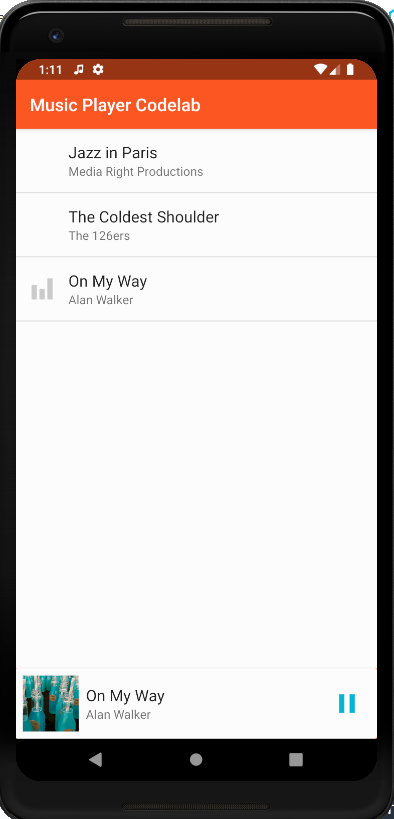
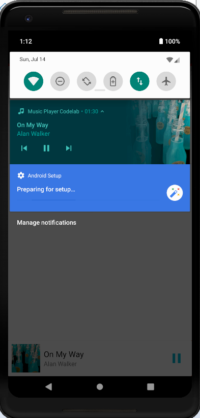

# Codelab for playing music on cars and wearables

This repository contains the source material for the "Playing music on cars and
wearables" codelab. [Access the codelabs](https://codelabs.developers.google.com/codelabs/android-music-player/index.html)

MusicPlayer Codelab

Overview file is attached as a word file: MusicPlayerOverview.docx

Instructions:

- Run the Android project under the "base" folder.
- Create a new Virtual Device if not already. Then, choose Pixel 2 XL, then click OK.
- It will load the music player for the users to play.

